# Flutter Fundamental

## Penjelasan Singkat
Pada materi ini, kita mempelajari konsep dan praktik untuk dasar-dasar framework Flutter termasuk fitur penggunaan hot reload dan restart serta widget dasar dan temanya.

## Tujuan Praktikum
Setelah menyelesaikan materi ini diharapkan mampu untuk:
- Menjelaskan bagian-bagian dari project file flutter
- Menggunakan fitur hot reload dan restart
- Menjelaskan perbedaan stateful dan stateless widget
- Menerapkan widget-widget dasar flutter dan tema

## Membuat Project Flutter Baru
Buat project baru dengan perintah
```bash
$ flutter create hello_world
```
Setelah itu kita buka folder ini menggunakan code editor
```bash
$ code hello_world
```
Berikut tampilan dari project `hello_world` yang telah kita buat
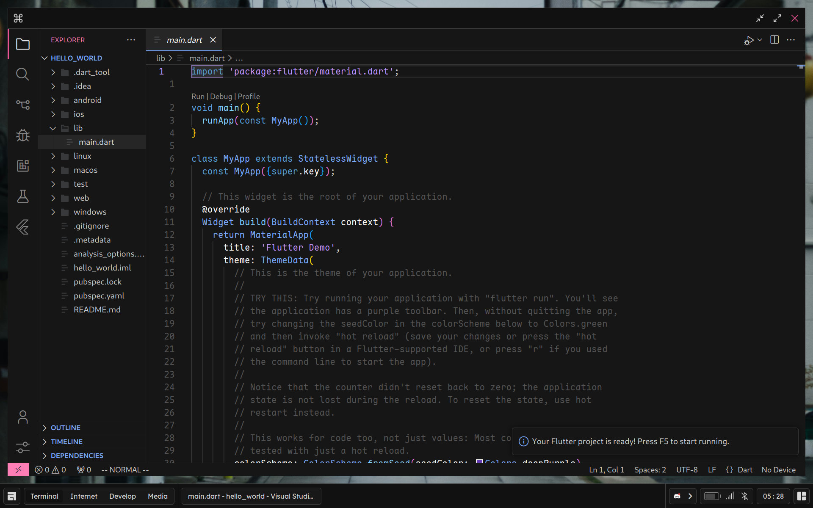

## Membuat Repository GitHub
Buat repository baru dengan nama `flutter-fundamental-part1`
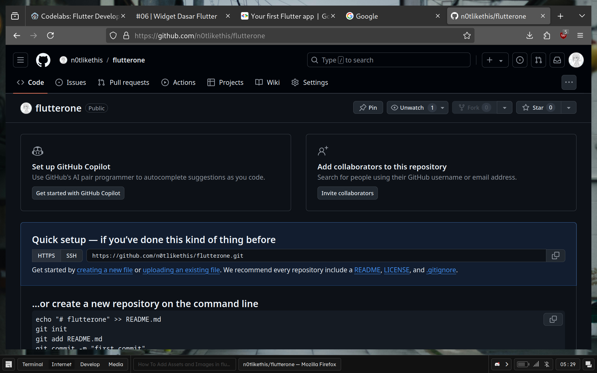
Setelah itu kembali ke project kita dan jalankan perintah
```bash
$ git init
$ git remote add origin LinkRepoGithub
$ git branch -M main
```
Lakukan first commit dengan cara
```bash
$ git add .
$ git commit -m "pesan commit"
```
Setelah itu kita push ke branch `main`
```bash
$ git push -u origin main
```
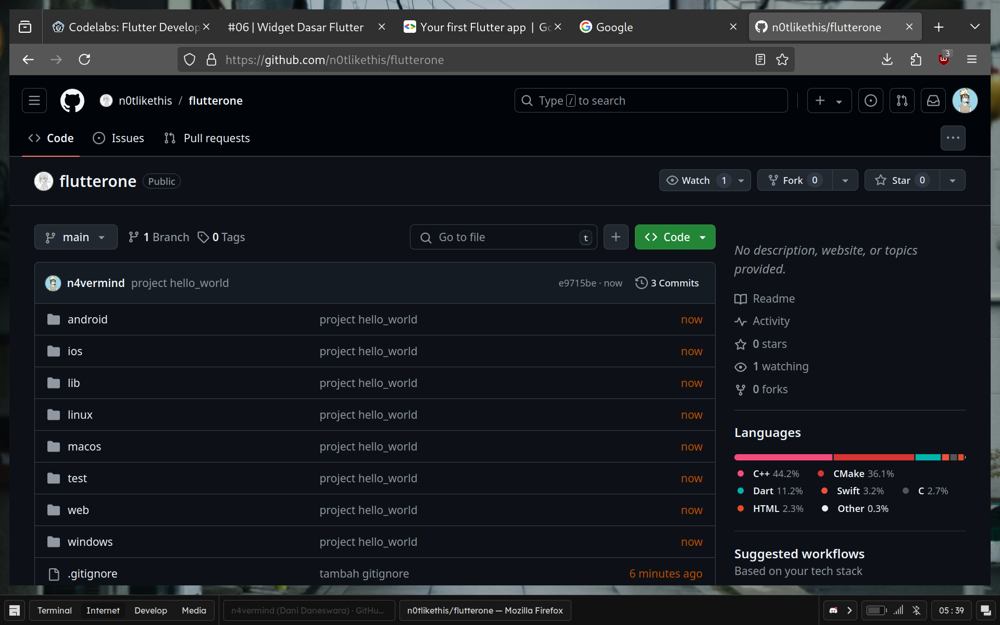
Coba lakukan running project `hello_world` dengan perintah
```bash
$ flutter run
```
Maka akan muncul tampilan seperti berikut
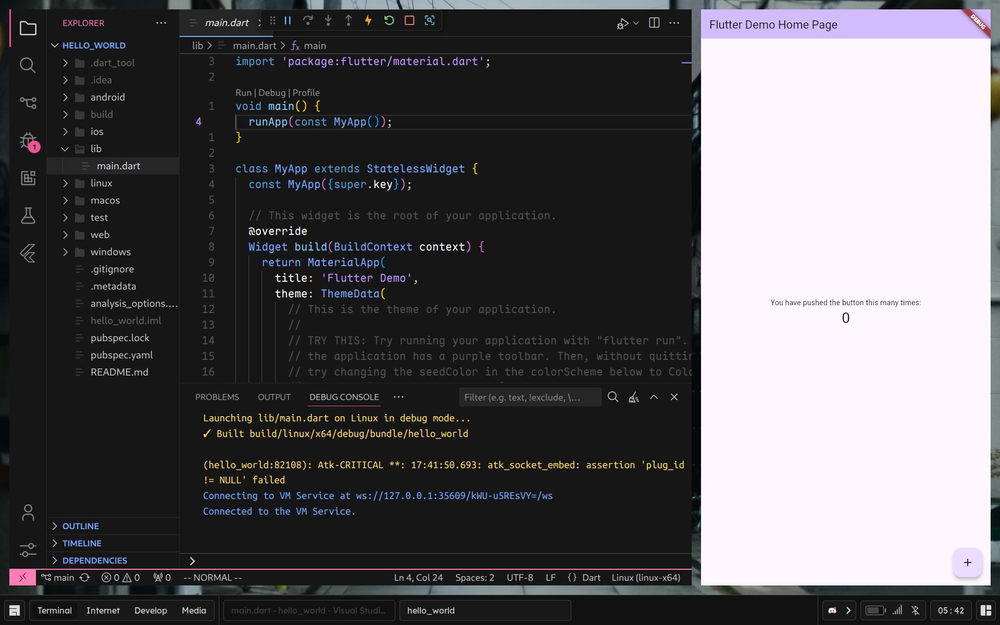

## Menerapkan Widget Dasar

### Text Widget
Buat folder baru `basic_widgets` di dalam folder `lib`. Kemudian buat file baru di dalam `basic_widgets` dengan nama `text_widget.dart`. Kita tulis codenya dan jalankan
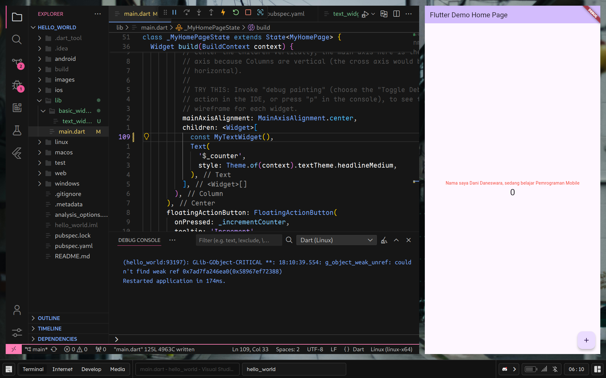

### Image Widget
Selanjutnya buat file baru `image_widget.dart` di dalam folder `basic_widgets`. Kemudian lakukan penyesuaian asset pada `pubspec.yaml` dan tambahkan logo di folder `assets`. Setelah itu kita tulis codenya dan jalankan
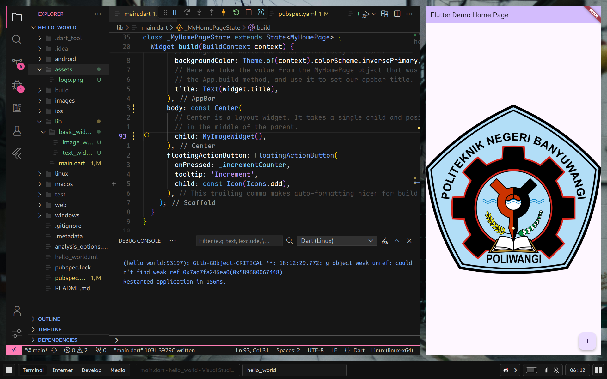

## Menerapkan Widget Material Design

### Cuppertino Button dan Loading Bar
Buat file baru dengan nama `loading_cupertino.dart` di dalam folder `basic_widgets`. Tulis codenya lalu jalankan
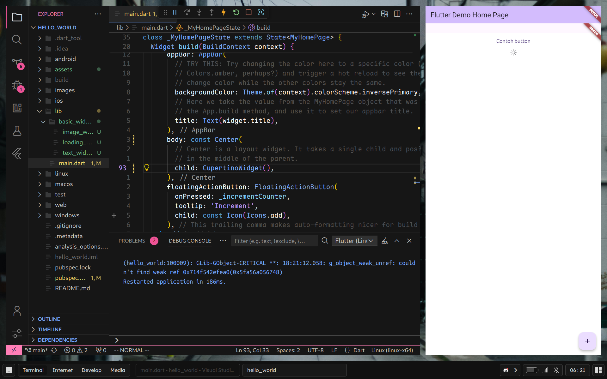

### Floating Action Button (FAB)
Buat file baru `fab_widget.dart` di dalam folder `basic_widgets`. Tuliskan codenya setelah itu jalankan
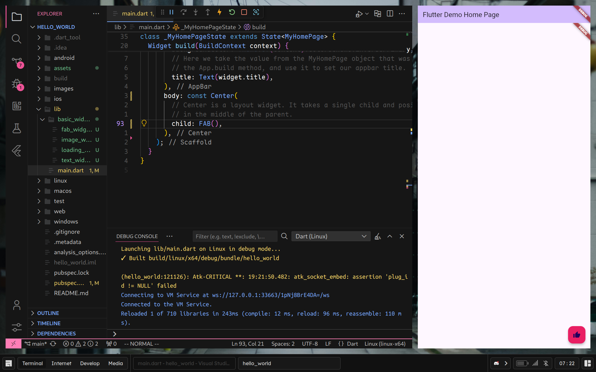

### Scaffold Widget
Kita bisa membuat file baru `scaffold_widget.dart` di dalam folder `basic_widgets`. Kita Tuliskan codenya setelah itu jalankan
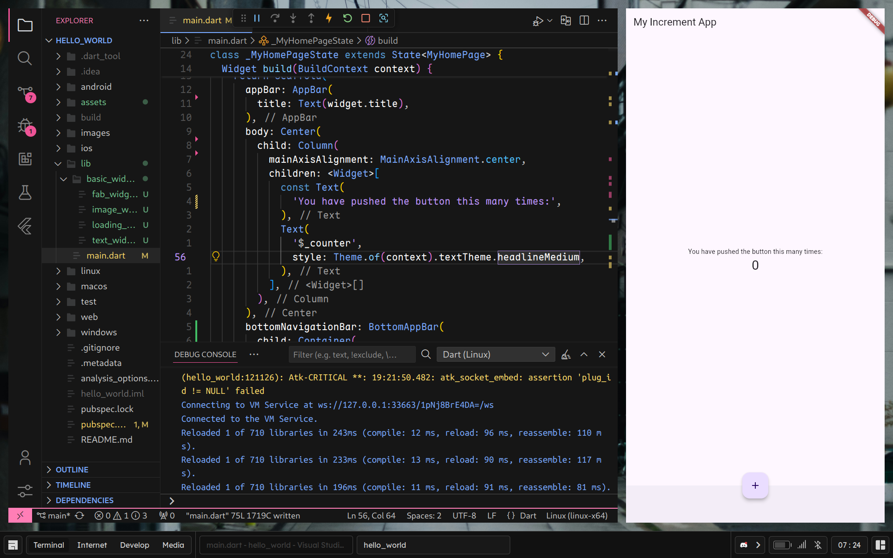

### Dialog Widget
Kita bisa membuat file baru `dialog_widget.dart` di dalam folder `basic_widgets`. Tuliskan codenya setelah itu kita coba jalankan
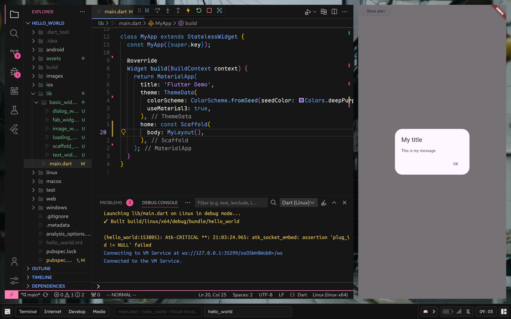

### Input dan Selection Widget
Buat file baru `input_widget.dart` di dalam folder `basic_widgets`. Tuliskan codenya setelah itu jalankan
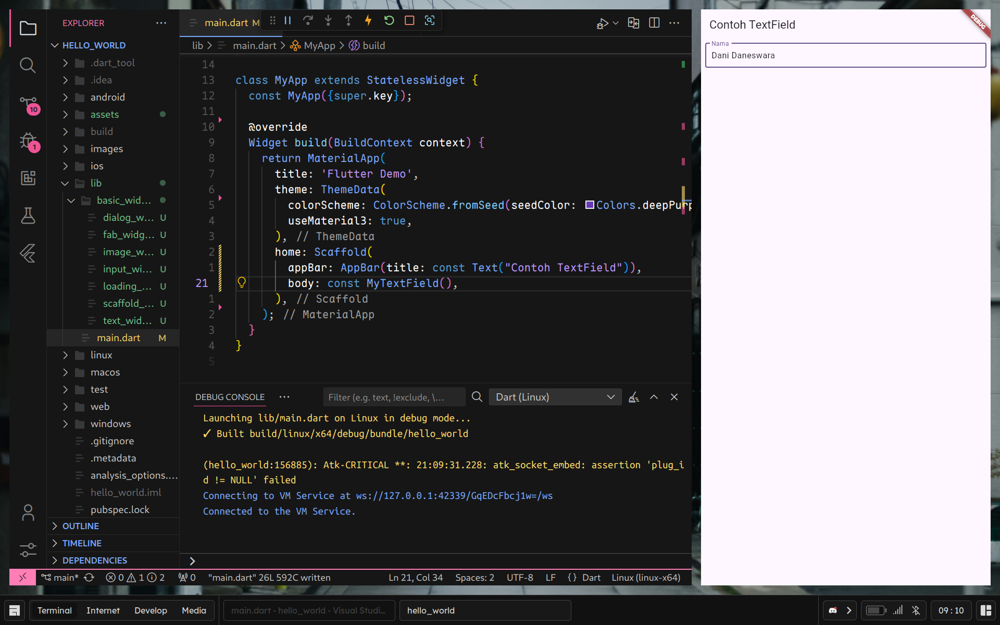

### Date and Time Pickers
Buat file baru dengan nama `date_picker.dart` di dalam folder `basic_widgets`. Tuliskan codenya setelah itu jalankan
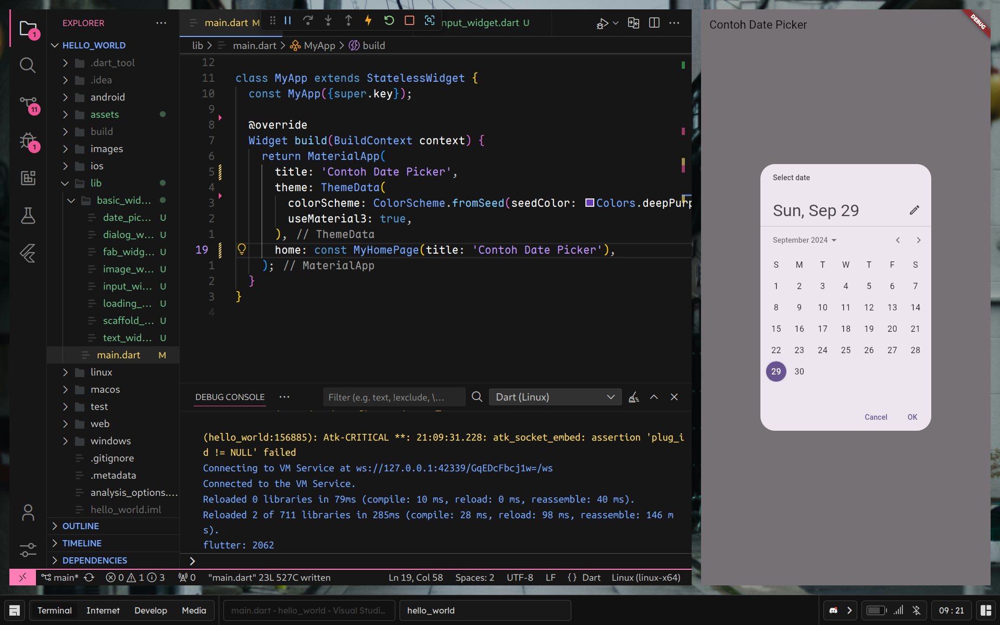

## Referensi
- [Codelabs: Pemrograman Mobile](https://fluttercodelabs.netlify.app)
- [Flutter Docs](https://docs.flutter.dev)
